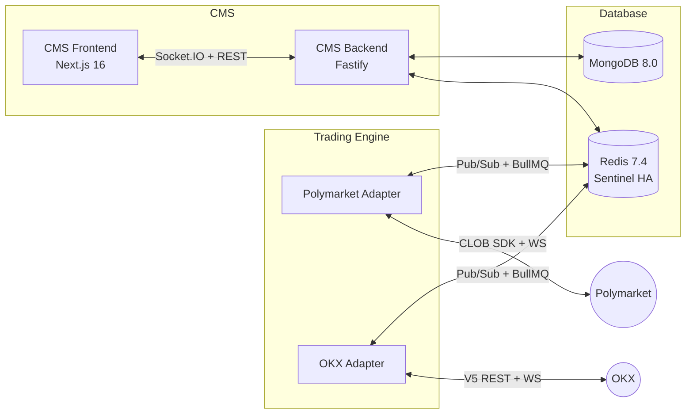

# Multi-Exchange Trading Bot System

[](https://github.com/PolyVN/trading-docs/blob/main/01-trading-engine/architecture.md)
[](https://github.com/PolyVN/trading-docs/blob/main/03-cms-backend/architecture.md)
[](https://github.com/PolyVN/trading-docs/blob/main/04-cms-frontend/architecture.md)
[](https://github.com/PolyVN/trading-docs/blob/main/06-infrastructure/docker-compose.md)
[](https://github.com/PolyVN/trading-docs/blob/main/03-cms-backend/database-schemas.md)
[](https://github.com/PolyVN/trading-docs/blob/main/06-infrastructure/docker-compose.md)
[](LICENSE)

Event-driven trading bot platform supporting **Polymarket** (on-chain prediction markets) and **OKX** (spot/futures/perpetuals), with a unified CMS dashboard and cross-exchange arbitrage support.



## Key Features

- **Multi-exchange** — Polymarket + OKX via adapter pattern; extensible to new exchanges
- **Cross-exchange arb** — Polymarket vs OKX futures; extensible to new prediction markets
- **Compiled strategies** — Market making, signal-based, arbitrage, grid trading, funding rate arb, DCA (Rust, trait-based)
- **Risk management** — Per-bot + portfolio-level limits, cross-exchange aggregation, auto-stop
- **Paper trading** — Real feeds, simulated execution per exchange (incl. leverage/liquidation for OKX)
- **Realtime dashboard** — Next.js 16 + shadcn/ui, Socket.IO, exchange selector, live PnL
- **Horizontal scaling** — Multiple TE instances, Redis-based engine registry
- **Redis Sentinel HA** — Master + replica + 3 sentinels, fail-closed on Redis failure

## Architecture

| Component | Stack |
|-----------|-------|
| Trading Engine | **Rust 2024 edition** (tokio 1.49), polymarket-client-sdk, redis 1.0, tokio-tungstenite 0.28, reqwest 0.13, serde 1.0, tracing 0.1, prometheus-client 0.24 |
| Shared Types | JSON Schema (source of truth) → codegen to TypeScript (`json-schema-to-typescript 15.0`) + Rust (`typify 0.6`) |
| CMS Backend | Node.js 22 LTS / TypeScript 5.9: Fastify 5.7, Mongoose 9.2, Socket.IO 4.8, BullMQ 5.70, Pino 10.3, Zod 4.3, decimal.js 10.6 |
| CMS Frontend | Next.js 16 / React 19.2, shadcn/ui, Tailwind CSS 4.2, TanStack Query 5.90, TanStack Table 8.21, Recharts 3.7, Socket.IO Client 4.8, NextAuth.js 4.24 |
| Infrastructure | Docker Compose v2, Redis 7.4 (Sentinel), MongoDB 8.0, Prometheus 3.x, Grafana 11.x, Caddy 2.9 |

## Prerequisites

- **Rust** 1.85+ (`rustup`, `cargo`)
- **Node.js** 22+ LTS (`npm`)
- **Docker** 27+ & Docker Compose v2
- **Git** with SSH keys added to GitHub
- **Servers**: 3 servers minimum (TE + CMS + DB) with private network (10.0.0.0/24 recommended); optionally 4+ with dedicated TE per exchange
- **Exchange credentials**: Managed via CMS API (not .env files) — Polymarket wallet private key, OKX API key/secret/passphrase

## Repositories

This root repo contains orchestration and submodules. Implementation lives across sub-repos:

| Repo | Path | Description |
|------|------|-------------|
| [`trading-docs`](https://github.com/PolyVN/trading-docs) | `docs/` (submodule, private) | Architecture documentation (38 files) |
| [`trading-shared-types`](https://github.com/PolyVN/trading-shared-types) | `packages/shared-types/` (submodule) | JSON Schema → `@polyvn/shared-types` (npm) + `polyvn-shared-types` (Rust crate) |
| [`trading-engine`](https://github.com/PolyVN/trading-engine) | — | Rust trading engine: bot execution, exchange adapters, strategies |
| [`trading-cms-backend`](https://github.com/PolyVN/trading-cms-backend) | — | Node.js/TypeScript: Fastify REST API, BullMQ workers, Socket.IO relay |
| [`trading-cms-frontend`](https://github.com/PolyVN/trading-cms-frontend) | — | Next.js 16 dashboard, exchange selector, realtime UI |
| [`trading-docker`](https://github.com/PolyVN/trading-docker) | — | Docker Compose per service (database, trading-engine, cms) |

## Documentation

> Architecture docs are in the private [`trading-docs`](https://github.com/PolyVN/trading-docs) submodule (`docs/`). Clone with `--recurse-submodules` to access.

| Section | Contents |
|---------|----------|
| [00 - Overview](https://github.com/PolyVN/trading-docs/blob/main/00-overview.md) | System overview, exchange support matrix, decisions log |
| [01 - Trading Engine](https://github.com/PolyVN/trading-docs/tree/main/01-trading-engine) | Exchange abstraction, feeds, execution, risk, strategies, paper trading |
| [02 - Exchanges](https://github.com/PolyVN/trading-docs/tree/main/02-exchanges) | Registry, Polymarket, OKX adapters |
| [03 - CMS Backend](https://github.com/PolyVN/trading-docs/tree/main/03-cms-backend) | API routes, database schemas, RBAC, queue workers |
| [04 - CMS Frontend](https://github.com/PolyVN/trading-docs/tree/main/04-cms-frontend) | Pages, exchange selector, realtime hooks |
| [05 - Communication](https://github.com/PolyVN/trading-docs/tree/main/05-communication) | Redis Pub/Sub channels, BullMQ queues, WebSocket protocol |
| [06 - Infrastructure](https://github.com/PolyVN/trading-docs/tree/main/06-infrastructure) | Docker Compose, deployment, monitoring, security |
| [07 - Shared Types](https://github.com/PolyVN/trading-docs/tree/main/07-shared-types) | JSON Schema → TypeScript + Rust codegen |
| [08 - Implementation](https://github.com/PolyVN/trading-docs/tree/main/08-implementation) | Roadmap, verification checklist |
| [Troubleshooting](https://github.com/PolyVN/trading-docs/blob/main/troubleshooting.md) | Common errors and debugging guide |

## Quick Start

```bash
# Clone with all submodules (docs + shared-types)
git clone --recurse-submodules git@github.com:PolyVN/trading-bot-platform.git
cd trading-bot-platform

# Clone implementation repos
git clone git@github.com:PolyVN/trading-engine.git packages/trading-engine
git clone git@github.com:PolyVN/trading-cms-backend.git packages/trading-cms-backend
git clone git@github.com:PolyVN/trading-cms-frontend.git packages/trading-cms-frontend
git clone git@github.com:PolyVN/trading-docker.git packages/trading-docker
```

> **Important**: Services must be started in order: **Database → Shared Types → Trading Engine → CMS**. The Trading Engine depends on Redis, and the CMS depends on both Redis and MongoDB.

```bash
# 1. Start database layer
cd packages/trading-docker/database
cp .env.example .env        # fill in MongoDB/Redis passwords
docker compose up -d

# 2. Generate shared types (used by engine + cms-backend)
cd ../../shared-types
npm install && npm run generate   # generates TypeScript + Rust types from JSON Schema

# 3. Build and start trading engine
cd ../trading-engine
cargo build --release
cd ../trading-docker/trading-engine
cp .env.example .env        # fill in REDIS_PASSWORD, ENCRYPTION_KEY
docker compose up -d

# 4. Start CMS
cd ../cms
cp .env.example .env        # fill in passwords, JWT/NextAuth secrets
docker compose up -d

# 5. Verify everything is running
curl http://localhost:3001/api/system/health        # CMS Backend health
curl http://localhost:3001/api/engines              # should list registered TEs
```

See [`packages/docker/`](packages/docker/) for `.env.example` templates per service (infrastructure config only — exchange credentials are managed via CMS).
See [deployment guide](https://github.com/PolyVN/trading-docs/blob/main/06-infrastructure/deployment.md) for full setup, firewall rules, and reverse proxy config.

## Creating Your First Bot

After all services are running, create a bot via the CMS API (or use the dashboard at `http://localhost:3000`):

```bash
# 1. Login to get a JWT token
TOKEN=$(curl -s -X POST http://localhost:3001/api/auth/login \
  -H "Content-Type: application/json" \
  -d '{"email": "admin@example.com", "password": "your-password"}' \
  | jq -r '.token')

# 2. Register a wallet (Polymarket example)
WALLET_ID=$(curl -s -X POST http://localhost:3001/api/wallets \
  -H "Authorization: Bearer $TOKEN" \
  -H "Content-Type: application/json" \
  -d '{
    "name": "pm-wallet-1",
    "exchange": "polymarket",
    "credentials": {
      "proxyAddress": "0xYourProxyAddress",
      "encryptedPrivateKey": "aes256gcm:..."
    }
  }' | jq -r '.walletId')

# 3. Create a market-making bot (paper mode for testing)
BOT_ID=$(curl -s -X POST http://localhost:3001/api/bots \
  -H "Authorization: Bearer $TOKEN" \
  -H "Content-Type: application/json" \
  -d '{
    "name": "pm-mm-test",
    "exchange": "polymarket",
    "strategy": "market-making",
    "walletId": "'$WALLET_ID'",
    "mode": "paper",
    "config": { "spread": 0.03, "orderSize": 10 },
    "exchangeConfig": { "marketId": "0x...", "tokenId": "71321045..." },
    "riskLimits": { "maxDailyLoss": 50, "maxDrawdown": 10, "maxPositionSize": 200 }
  }' | jq -r '.botId')

# 4. Start the bot
curl -X POST "http://localhost:3001/api/bots/$BOT_ID/start" \
  -H "Authorization: Bearer $TOKEN"
```

See [API routes](https://github.com/PolyVN/trading-docs/blob/main/03-cms-backend/api-routes.md) for full endpoint reference.

## License

[MIT](LICENSE)
