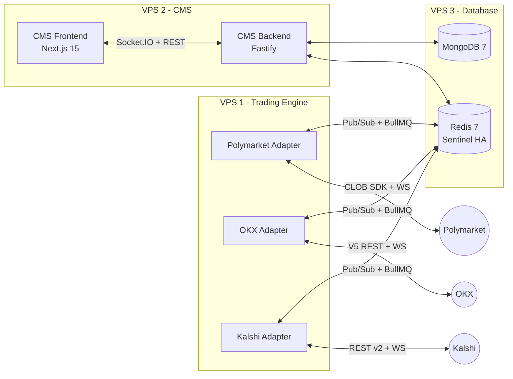

# Multi-Exchange Trading Bot System

Event-driven trading bot platform supporting **Polymarket** (on-chain prediction markets), **OKX** (spot/futures/perpetuals), and **Kalshi** (CFTC-regulated prediction markets), with a unified CMS dashboard and cross-market arbitrage support.



## Key Features

- **Multi-exchange** — Polymarket, OKX, Kalshi via adapter pattern; extensible to new exchanges
- **Cross-market arb** — Same event on Polymarket + Kalshi at different probabilities; Polymarket vs OKX futures
- **Plugin strategies** — Market making, signal-based, arbitrage, grid trading, funding rate arb, DCA
- **Risk management** — Per-bot + portfolio-level limits, cross-exchange aggregation, auto-stop
- **Paper trading** — Real feeds, simulated execution per exchange (incl. leverage/liquidation for OKX)
- **Realtime dashboard** — Next.js 15 + shadcn/ui, Socket.IO, exchange selector, live PnL
- **Horizontal scaling** — Multiple TE instances, Redis-based engine registry
- **Redis Sentinel HA** — Master + replica + 3 sentinels, fail-closed on Redis failure

## Architecture

| Component | Stack |
|-----------|-------|
| Trading Engine | **Rust** (tokio), polymarket-client-sdk, redis-rs, tokio-tungstenite, serde, tracing, prometheus-client |
| Shared Types | JSON Schema (source of truth) → codegen to TypeScript + Rust |
| CMS Backend | Node.js/TypeScript: Fastify, Mongoose, Socket.IO, BullMQ workers |
| CMS Frontend | Next.js 15, shadcn/ui, TanStack Query v5, Recharts |
| Infrastructure | Docker Compose, Redis 7 (Sentinel), MongoDB 7, Prometheus, Grafana |

## Repositories

This root repo (`trading-system`) contains architecture documentation and orchestration only. Implementation lives across 5 sub-repos:

| Repo | Description | Clone |
|------|-------------|-------|
| [`trading-shared-types`](https://github.com/PolyVN/trading-shared-types) | JSON Schema (source of truth) → `@polyvn/shared-types` (npm) + `polyvn-shared-types` (Rust crate) | `git@github.com:PolyVN/trading-shared-types.git` |
| [`trading-engine`](https://github.com/PolyVN/trading-engine) | Rust trading engine: bot execution, exchange adapters, strategies | `git@github.com:PolyVN/trading-engine.git` |
| [`trading-cms-backend`](https://github.com/PolyVN/trading-cms-backend) | Node.js/TypeScript: Fastify REST API, BullMQ workers, Socket.IO relay | `git@github.com:PolyVN/trading-cms-backend.git` |
| [`trading-cms-frontend`](https://github.com/PolyVN/trading-cms-frontend) | Next.js 15 dashboard, exchange selector, realtime UI | `git@github.com:PolyVN/trading-cms-frontend.git` |
| [`trading-docker`](https://github.com/PolyVN/trading-docker) | Docker Compose per VPS (database, trading, cms) | `git@github.com:PolyVN/trading-docker.git` |

## Documentation

Full architecture docs in [`docs/`](docs/00-overview.md):

| Section | Contents |
|---------|----------|
| [00 - Overview](docs/00-overview.md) | System overview, exchange support matrix, decisions log |
| [01 - Trading Engine](docs/01-trading-engine/) | Exchange abstraction, feeds, execution, risk, strategies, paper trading |
| [02 - Exchanges](docs/02-exchanges/) | Registry, Polymarket, OKX, Kalshi adapters |
| [03 - CMS Backend](docs/03-cms-backend/) | API routes, database schemas, RBAC, queue workers |
| [04 - CMS Frontend](docs/04-cms-frontend/) | Pages, exchange selector, realtime hooks |
| [05 - Communication](docs/05-communication/) | Redis Pub/Sub channels, BullMQ queues, WebSocket protocol |
| [06 - Infrastructure](docs/06-infrastructure/) | Docker Compose, deployment, monitoring, security |
| [07 - Shared Types](docs/07-shared-types/) | JSON Schema → TypeScript + Rust codegen |
| [08 - Implementation](docs/08-implementation/) | Roadmap, verification checklist |

## Quick Start

```bash
# Clone all repos into a parent directory
mkdir polyvn && cd polyvn

git clone git@github.com:PolyVN/trading-system.git
git clone git@github.com:PolyVN/trading-shared-types.git
git clone git@github.com:PolyVN/trading-engine.git
git clone git@github.com:PolyVN/trading-cms-backend.git
git clone git@github.com:PolyVN/trading-cms-frontend.git
git clone git@github.com:PolyVN/trading-docker.git
```

```bash
# 1. Start database layer (VPS 3)
cd trading-docker/vps3-database
cp .env.example .env        # fill in Redis/Mongo passwords
docker compose up -d

# 2. Generate shared types (used by engine + cms-backend)
cd ../../trading-shared-types
npm install && npm run generate   # generates TypeScript + Rust types from JSON Schema

# 3. Build trading engine (Rust)
cd ../trading-engine
cargo build --release

# 4. Start trading engine (VPS 1)
cd ../trading-docker/vps1-trading
cp .env.example .env        # fill in exchange credentials (Polymarket PK, OKX keys, Kalshi key)
docker compose up -d

# 5. Start CMS (VPS 2)
cd ../vps2-cms
cp .env.example .env
docker compose up -d
```

See [deployment guide](docs/06-infrastructure/deployment.md) for full VPS setup, firewall rules, and environment variables.

## License

[MIT](LICENSE)
