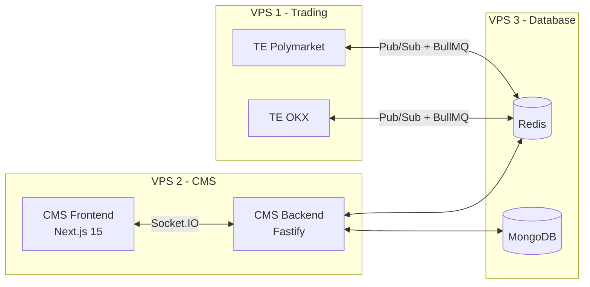

# Multi-Exchange Trading Bot System

Event-driven trading bot platform supporting **Polymarket** (prediction markets) and **OKX** (spot/futures/perpetuals), with a unified CMS dashboard.



## Key Features

- **Multi-exchange** - Polymarket & OKX via exchange adapter pattern, extensible to new exchanges
- **Plugin strategies** - Market making, signal-based, arbitrage, grid trading, funding rate arb, DCA
- **Risk management** - Per-bot + portfolio-level limits, cross-exchange aggregation, auto-stop
- **Paper trading** - Real feeds, simulated execution per exchange (incl. leverage/liquidation for OKX)
- **Realtime dashboard** - Next.js 15 + shadcn/ui, Socket.IO, exchange selector, live PnL
- **Horizontal scaling** - Multiple TE instances with Redis-based engine registry

## Architecture

| Component | Stack |
|-----------|-------|
| Trading Engine | Node.js 20+, TypeScript, ioredis, BullMQ, prom-client |
| CMS Backend | Fastify, Mongoose, Socket.IO, BullMQ workers |
| CMS Frontend | Next.js 15, shadcn/ui, TanStack Query v5, Recharts |
| Infrastructure | Docker Compose, Redis 7 (Sentinel), MongoDB 7, Prometheus, Grafana |

## Documentation

Full architecture docs in [`docs/`](docs/00-overview.md):

| Section | Contents |
|---------|----------|
| [00 - Overview](docs/00-overview.md) | System overview, exchange support, decisions log |
| [01 - Trading Engine](docs/01-trading-engine/) | Exchange abstraction, feeds, execution, risk, strategies, paper trading |
| [02 - Exchanges](docs/02-exchanges/) | Exchange registry, Polymarket adapter, OKX adapter |
| [03 - CMS Backend](docs/03-cms-backend/) | API routes, database schemas, RBAC, queue workers |
| [04 - CMS Frontend](docs/04-cms-frontend/) | Pages, exchange selector, realtime hooks |
| [05 - Communication](docs/05-communication/) | Redis Pub/Sub, BullMQ queues, WebSocket protocol |
| [06 - Infrastructure](docs/06-infrastructure/) | Docker Compose, deployment, monitoring, security |
| [07 - Shared Types](docs/07-shared-types/) | All TypeScript interfaces |
| [08 - Implementation](docs/08-implementation/) | Roadmap, verification checklist |

## Quick Start

```bash
# 1. Clone all repos
git clone <this-repo>

# 2. Start database layer (VPS 3)
cd polymarket-docker/vps3-database
cp .env.example .env  # fill in passwords
docker compose up -d

# 3. Start trading engine (VPS 1)
cd ../vps1-trading
cp .env.example .env  # fill in exchange credentials
docker compose up -d

# 4. Start CMS (VPS 2)
cd ../vps2-cms
cp .env.example .env
docker compose up -d
```

See [deployment guide](docs/06-infrastructure/deployment.md) for full instructions.

## License

[MIT](LICENSE)
